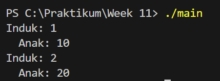
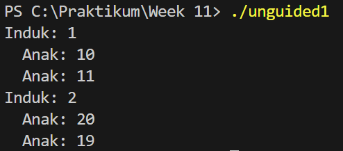
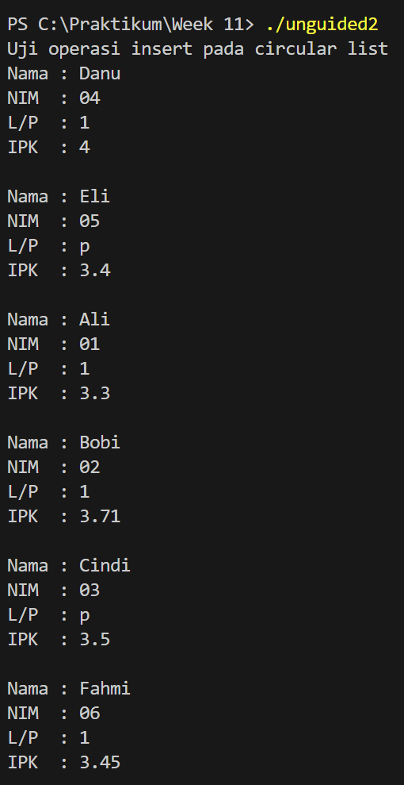
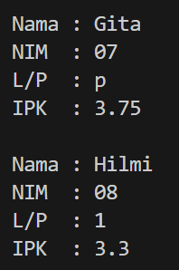

## 1. Nama, NIM, Kelas
- **Nama**: Muhammad Faozan Azril Zidan
- **NIM**: 103112430141
- **Kelas**: Struktur Data-05

## 2. Motivasi Belajar Struktur Data
Belajar struktur data itu bukan cuma soal teori atau nulis kode, tapi lebih ke melatih cara berpikir supaya rapi dan efisien. Dengan data yang tertata, nyari dan ngolah informasi jadi lebih gampang. Walaupun awalnya terasa ribet, lama-lama ilmu ini kepake banget dan jadi bekal penting di dunia teknologi.

## 3. Dasar Teori

Struktur data merupakan cara untuk menyimpan dan mengatur data di dalam komputer supaya proses pengolahan dan pencarian data bisa dilakukan dengan lebih efektif. Dua konsep dasar yang sering digunakan adalah Multi Linked List dan Circular Linked List.

Multi Linked List adalah struktur data dinamis yang terdiri dari beberapa list yang saling terhubung. Pada contoh kasus data Pegawai, struktur ini menggambarkan hubungan bertingkat, di mana List Induk berperan sebagai parent dan setiap elemennya memiliki pointer yang mengarah ke List Anak. Dengan demikian, setiap pegawai dapat memiliki daftar data anaknya sendiri yang berdiri secara terpisah. Secara implementasi, baik list induk maupun list anak menggunakan Doubly Linked List, sehingga setiap elemen memiliki pointer next dan prev yang memungkinkan penelusuran dilakukan ke dua arah. Pengelolaan data pada struktur ini memiliki aturan khusus, misalnya ketika satu elemen induk dihapus, maka seluruh elemen anak yang terkait dengannya juga harus ikut dihapus agar tidak terjadi data yang terputus.

Circular Linked List sendiri merupakan bentuk linked list di mana elemen terakhir tidak menunjuk ke NULL, melainkan kembali mengarah ke elemen pertama, sehingga membentuk sebuah lingkaran. Pada studi kasus data Mahasiswa, struktur ini digunakan untuk menyimpan informasi seperti Nama, NIM, Jenis Kelamin, dan IPK. Karena bersifat melingkar, proses penelusuran data tidak memiliki titik akhir, melainkan berhenti ketika pointer next kembali ke elemen pertama. Karakteristik ini sangat cocok untuk kebutuhan aplikasi yang memerlukan perulangan data secara terus-menerus tanpa harus mengatur ulang penunjuk ke awal list.
## 4. Guided
### 4.1 Guided 1
```cpp
#ifndef MULTILIST_H_INCLUDED
#define MULTILIST_H_INCLUDED

#define Nil NULL

typedef int infotype;

struct elemen_induk;
struct elemen_anak;

typedef elemen_induk* address_induk;
typedef elemen_anak*  address_anak;

struct list_anak {
    address_anak first;
    address_anak last;
};
struct elemen_anak {
    infotype info;
    address_anak prev;
    address_anak next;
};
struct elemen_induk {
    infotype info;
    list_anak anak;
    address_induk prev;
    address_induk next;
};
struct list_induk {
    address_induk first;
    address_induk last;
};

  

void createList(list_induk &L);
address_induk alokasi(infotype x);
void insertLastInduk(list_induk &L, address_induk P);
address_induk findInduk(list_induk L, infotype x);
address_anak alokasiAnak(infotype x);
void insertLastAnak(list_anak &LA, address_anak PA);
void printInfo(list_induk L);

#endif
```
Penjelasan : File multilist.h berfungsi sebagai antarmuka utama yang menentukan kerangka dasar struktur data Multi Linked List. File ini diawali dengan penggunaan header guard serta pendefinisian tipe data untuk menjaga konsistensi penamaan di seluruh program. Bagian terpentingnya terletak pada pendefinisian empat struktur utama, yaitu `elemen_anak` dan `list_anak` sebagai sub-list, serta `elemen_induk` yang dirancang khusus karena memiliki field bertipe `list_anak`. Desain ini membentuk hubungan hierarkis, di mana setiap node induk secara langsung memiliki dan mengelola list anaknya sendiri. Keseluruhan struktur tersebut kemudian diatur melalui `list_induk` dan dilengkapi dengan kumpulan deklarasi prototipe fungsi atau ADT (Abstract Data Type) yang mencakup pengelolaan memori, pembuatan list, serta operasi manipulasi data seperti penambahan, penghapusan, dan pencarian. Dengan pendekatan ini, logika pengelolaan data antara induk dan anak dapat diterapkan secara terpisah namun tetap saling terhubung dalam satu sistem yang utuh.


### 4.2 Guided 2
```cpp
#include "multilist.h"
#include <iostream>

using namespace std;

void createList(list_induk &L) 
    L.first = Nil;
    L.last  = Nil;
}

address_induk alokasi(infotype data) {
    address_induk node = new elemen_induk;

    node->info = data;
    node->next = Nil;
    node->prev = Nil;

    node->anak.first = Nil;
    node->anak.last  = Nil;

    return node;
}

void insertLastInduk(list_induk &L, address_induk node) {
    if (L.first != Nil) {
        node->prev = L.last;
        L.last->next = node;
        L.last = node;
    } else {
        L.first = node;
        L.last  = node;
    }
}

address_induk findInduk(list_induk L, infotype key) {
    for (address_induk p = L.first; p != Nil; p = p->next) {
        if (p->info == key) {
            return p;
        }
    }
    return Nil;
}
```


Penjelasan :File multilist.cpp berperan sebagai bagian implementasi utama yang menangani proses pengelolaan List Induk pada struktur Multi Linked List. Di dalam file ini terdapat penerapan langsung dari fungsi-fungsi dasar, diawali dengan fungsi alokasi yang bertugas menyediakan memori untuk elemen induk sekaligus menginisialisasi pointer pada list anak agar berada dalam kondisi siap pakai. Seluruh operasi pada tingkat induk dikelola menggunakan mekanisme Doubly Linked List, termasuk pengaturan pointer `next` dan `prev` pada proses penambahan maupun penghapusan data. Selain itu, file ini juga menyediakan fungsi `printInfo` yang menggunakan perulangan bertingkat untuk menelusuri setiap elemen induk, lalu mengakses list anak yang dimilikinya sehingga seluruh struktur data dapat ditampilkan secara runtut dan hierarkis.
### 4.3 Guided 3

```cpp
#include "multilist.h"
#include <iostream>

using namespace std;

address_anak alokasiAnak(infotype nilai) {
    address_anak nodeBaru = new elemen_anak;
    nodeBaru->info = nilai;
    nodeBaru->next = Nil;
    nodeBaru->prev = Nil;
    return nodeBaru;
}

void insertLastAnak(list_anak &LA, address_anak node) {
    if (LA.first != Nil) {
        node->prev = LA.last;
        LA.last->next = node;
        LA.last = node;
    } else {
        LA.first = node;
        LA.last  = node;
    }
}

void printInfo(list_induk L) {
    for (address_induk pInduk = L.first; pInduk != Nil; pInduk = pInduk->next) {
        cout << "Induk: " << pInduk->info << endl;

        address_anak pAnak = pInduk->anak.first;
        while (pAnak != Nil) {
            cout << "  Anak: " << pAnak->info << endl;
            pAnak = pAnak->next;
        }
    }
}
```


Penjelasan : File **multilist_anak.cpp** berfungsi sebagai modul khusus yang mengatur seluruh operasi pada tingkat sub-list atau List Anak, sehingga logikanya terpisah dari pengelolaan List Induk dan membuat struktur program lebih rapi. File ini berisi implementasi fungsi alokasi memori untuk membentuk node anak baru, serta berbagai prosedur manipulasi data seperti penambahan dan penghapusan elemen baik di awal maupun di akhir list. Semua operasi tersebut dijalankan dengan konsep Doubly Linked List, menggunakan pointer `next` dan `prev` untuk menghubungkan setiap elemen anak. Dengan pendekatan ini, pengelolaan data pada level anak dapat dilakukan secara fleksibel dan mandiri sebelum dikaitkan dengan elemen induk yang bersangkutan.


### 4.4 Guided 4

```cpp
#include <iostream>
#include "multilist.h"

using namespace std;

int main() {
    list_induk data;
    createList(data);

    address_induk firstInduk = alokasi(1);
    insertLastInduk(data, firstInduk);
    
    address_anak firstChild = alokasiAnak(10);
    insertLastAnak(firstInduk->anak, firstChild);

    address_induk secondInduk = alokasi(2);
    insertLastInduk(data, secondInduk);

    address_anak secondChild = alokasiAnak(20);
    insertLastAnak(secondInduk->anak, secondChild);

    printInfo(data);

    return 0;
}
```


Penjelasan :File **main.cpp** berfungsi sebagai program utama atau _driver_ yang digunakan untuk menguji apakah struktur data Multi Linked List dapat berjalan dengan baik dan saling terintegrasi. Pada file ini, list induk terlebih dahulu dibuat dan diinisialisasi, kemudian dilakukan alokasi memori untuk membentuk beberapa node induk beserta node anaknya. Bagian penting dari program ini terletak pada proses pembentukan hubungan hierarkis, yaitu dengan memasukkan node anak ke dalam list anak milik induk tertentu melalui pointer yang sesuai (misalnya `P1->anak`). Proses ini menunjukkan bahwa setiap elemen induk mampu mengelola sub-list anaknya sendiri secara terpisah. Setelah seluruh data tersusun, struktur Multi Linked List ditampilkan ke layar sebagai langkah pengecekan dan verifikasi hasil program.

Output : 

## 5. Unguided
### 5.1 Unguided 1
```cpp
#include "multilist.h"
#include <iostream>
using namespace std;

int main() {
    list_induk L;
    createList(L);

    address_induk P1 = alokasi(1);
    insertLastInduk(L, P1);

    address_induk P2 = alokasi(2);
    insertLastInduk(L, P2);

    insertLastAnak(P1->anak, alokasiAnak(10));
    insertLastAnak(P1->anak, alokasiAnak(11));

    insertLastAnak(P2->anak, alokasiAnak(20));
    insertLastAnak(P2->anak, alokasiAnak(19));

    printInfo(L);

    return 0;

}
```

Penjelasan :

Program diawali dengan menyiapkan struktur data, yaitu mendeklarasikan `list_induk` dan memanggil `createList` agar list berada dalam kondisi kosong dan siap digunakan. Setelah itu, data induk dibuat dengan mengalokasikan node baru dan menambahkannya ke dalam list menggunakan beberapa metode penyisipan, baik di awal, akhir, maupun setelah node tertentu, untuk memastikan mekanisme pointer pada list induk bekerja dengan benar.

Tahap berikutnya adalah membangun hubungan hierarkis dengan menambahkan data anak ke dalam sub-list milik induk tertentu. Proses ini menunjukkan bahwa setiap node induk dapat menyimpan dan mengelola daftar anaknya sendiri secara terpisah. Selanjutnya, fungsi `printInfo` dipanggil untuk menampilkan seluruh struktur data sebagai bentuk pengecekan awal terhadap hasil penyusunan data.

Pada tahap akhir, program menguji proses penghapusan dengan menghapus salah satu data anak dari induk tertentu. Setelah itu, data kembali ditampilkan untuk memastikan bahwa elemen yang dihapus benar-benar hilang, sementara struktur induk dan data lainnya tetap utuh dan tidak terpengaruh.

Output : 


### 5.2 Unguided 2
circular.h
```cpp
#ifndef CIRCULAR_H_INCLUDED
#define CIRCULAR_H_INCLUDED

#include <iostream>
#include <string>

#define Nil NULL

using namespace std;

struct mahasiswa {
    string nim;
    string nama;
    char   jenis_kelamin;
    float  ipk;
};

typedef mahasiswa infotype;

struct elemen;

typedef elemen* address;

struct elemen {
    infotype info;
    address  next;
};

struct List {
    address first;
};

void createList(List &L);

address alokasi(infotype data);

void insertFirst(List &L, address P);
void insertLast(List &L, address P);
void insertAfter(List &L, address Prec, address P);

void deleteFirst(List &L, address &P);
void deleteLast(List &L, address &P);

address findElm(List L, string nim);

void printInfo(List L);

#endif
```

Penjelasan :File **circular.h** dapat diibaratkan sebagai rancangan dasar atau panduan utama dalam pembuatan program Circular List untuk data Mahasiswa. Pada bagian awal, file ini menyiapkan struktur yang menyatukan seluruh informasi mahasiswa seperti Nama, NIM, Jenis Kelamin, dan IPK ke dalam satu kesatuan data agar mudah dikelola. Selain itu, didefinisikan pula bentuk node yang saling terhubung membentuk lingkaran, lengkap dengan penunjuk awal (`first`) sebagai titik awal pembacaan data dalam struktur tersebut.

Pada bagian selanjutnya, **circular.h** berisi kumpulan deklarasi fungsi yang menjelaskan operasi apa saja yang dapat dilakukan pada Circular List. Fungsi-fungsi tersebut mencakup pembuatan list, alokasi data baru, proses penambahan dan penghapusan data di berbagai posisi, hingga pencarian dan penampilan data mahasiswa. Dengan adanya daftar fungsi ini, bagian program lain dapat menggunakan seluruh fitur Circular List dengan mudah tanpa perlu mengetahui detail implementasinya, karena semua mekanisme kerja sudah ditangani di bagian lain program.

### 5.3 Unguided 3
```cpp
#include "circular.h"

void createList(List &L) {
    L.first = Nil;
}

address alokasi(infotype data) {
    address node = new elemen;
    node->info = data;
    node->next = Nil;
    return node;
}

void insertFirst(List &L, address node) {
    if (L.first == Nil) {
        L.first = node;
        node->next = node;
    } else {
        address tail = L.first;
        while (tail->next != L.first) {
            tail = tail->next;
        }
        node->next = L.first;
        tail->next = node;
        L.first = node;
    }
}

void insertLast(List &L, address node) {
    if (L.first == Nil) {
        insertFirst(L, node);
    } else {
        address tail = L.first;
        while (tail->next != L.first) {
            tail = tail->next;
        }
        tail->next = node;
        node->next = L.first;
    }
}

void insertAfter(List &L, address prev, address node) {
    if (prev != Nil) {
        node->next = prev->next;
        prev->next = node;
    }
}

void deleteFirst(List &L, address &node) {
    if (L.first == Nil) {
        node = Nil;
        return;
    }

    node = L.first;

    if (node->next == node) {
        L.first = Nil;
    } else {
        address tail = node;
        while (tail->next != L.first) {
            tail = tail->next;
        }
        L.first = node->next;
        tail->next = L.first;
    }
    node->next = Nil;
}

void deleteLast(List &L, address &node) {
    if (L.first == Nil) {
        node = Nil;
        return;
    }

    address curr = L.first;
    address prev = Nil;

    while (curr->next != L.first) {
        prev = curr;
        curr = curr->next;
    }

    node = curr;

    if (prev == Nil) {
        L.first = Nil;
    } else {
        prev->next = L.first;
    }
    node->next = Nil;
}

address findElm(List L, string nim) {
    if (L.first == Nil) return Nil;

    address p = L.first;
    do {
        if (p->info.nim == nim) {
            return p;
        }
        p = p->next;
    } while (p != L.first);

    return Nil;
}

void printInfo(List L) {
    if (L.first == Nil) {
        cout << "List Kosong" << endl;
        return;
    }

    address p = L.first;
    do {
        cout << "Nama : " << p->info.nama << endl;
        cout << "NIM  : " << p->info.nim << endl;
        cout << "L/P  : " << p->info.jenis_kelamin << endl;
        cout << "IPK  : " << p->info.ipk << endl;
        cout << endl;

        p = p->next;
    } while (p != L.first);
}
```

Penjelasan :File **circular.cpp** berisi implementasi nyata dari semua fungsi yang sebelumnya hanya dideklarasikan di file header. Di sinilah alur kerja program benar-benar dijalankan, mulai dari inisialisasi list kosong sampai proses penambahan data mahasiswa. Hal terpenting pada file ini adalah mekanisme menjaga struktur tetap berbentuk lingkaran, di mana setiap penambahan data, baik di awal maupun di akhir, selalu diikuti dengan pengaturan pointer agar elemen terakhir tetap terhubung kembali ke elemen pertama.

Selain itu, file ini juga mengatur proses penghapusan dan penampilan data supaya struktur list tetap rapi. Saat sebuah data dihapus, khususnya data pertama, program akan menyesuaikan kembali hubungan antar node agar tidak ada sambungan yang terputus. Fungsi `printInfo` dirancang menggunakan perulangan khusus yang hanya mengelilingi list satu kali penuh, sehingga seluruh data mahasiswa bisa ditampilkan dengan lengkap tanpa risiko perulangan tak berujung.


### 5.4 Unguided 4
```cpp
#include <iostream>
#include "circular.h"

using namespace std;

int main() {
    List data;
    createList(data);

    cout << "Uji operasi insert pada circular list" << endl;

    // Data awal
    infotype a = {"01", "Ali", '1', 3.3};
    infotype b = {"04", "Danu", '1', 4.0};
    infotype c = {"06", "Fahmi", '1', 3.45};

    insertFirst(data, alokasi(a));
    insertFirst(data, alokasi(b));
    insertLast(data, alokasi(c));

    // Insert setelah Ali
    address posAli = findElm(data, "01");
    if (posAli != Nil) {

        infotype d = {"02", "Bobi", '1', 3.71};
        insertAfter(data, posAli, alokasi(d));
    }

    // Insert setelah Bobi
    address posBobi = findElm(data, "02");
    if (posBobi != Nil) {
        infotype e = {"03", "Cindi", 'p', 3.5};
        insertAfter(data, posBobi, alokasi(e));
    }

    // Insert setelah Danu
    address posDanu = findElm(data, "04");
    if (posDanu != Nil) {
        infotype f = {"05", "Eli", 'p', 3.4};
        insertAfter(data, posDanu, alokasi(f));
    }
    
    // Tambah data di akhir
    insertLast(data, alokasi({"07", "Gita", 'p', 3.75}));

    // Insert setelah Gita
    address posGita = findElm(data, "07");
    if (posGita != Nil) {
        infotype g = {"08", "Hilmi", '1', 3.3};
        insertAfter(data, posGita, alokasi(g));
    }

    // Tampilkan seluruh isi list
    printInfo(data);

    return 0;
}
```

Penjelasan :

Unguided2.cpp berfungsi sebagai pengendali utama yang menjalankan keseluruhan program Circular List data mahasiswa. Program diawali dengan membuat list kosong, kemudian data mahasiswa dimasukkan satu per satu. Menariknya, proses input tidak dilakukan secara asal, tetapi disusun dengan strategi tertentu supaya urutan data akhirnya sesuai dengan NIM yang diminta, meskipun urutan penulisannya di kode terlihat tidak beraturan.

Untuk mencapai susunan tersebut, program memanfaatkan berbagai operasi pointer. Beberapa data dimasukkan di awal menggunakan insertFirst, sebagian ditempatkan di akhir lewat insertLast, dan sisanya disisipkan di posisi tertentu menggunakan insertAfter, seperti menambahkan satu mahasiswa tepat setelah mahasiswa lain. Setelah seluruh data masuk dan tersusun rapi, fungsi printInfo dipanggil untuk menampilkan hasil akhir, sekaligus memastikan bahwa struktur Circular List sudah terbentuk dengan benar dan saling terhubung membentuk lingkaran utuh.

Output : 



## 6. Kesimpulan
Secara umum, praktikum ini mengajak kita memahami struktur data yang lebih kompleks dibanding list biasa. Pada materi Multi Linked List, kita belajar menyusun data bertingkat seperti hubungan induk dan anak, di mana setiap pegawai punya daftar anak sendiri. Konsepnya menekankan keterkaitan data, jadi ketika data induk dihapus, data anak yang terhubung juga ikut terhapus. Sementara itu, pada Circular Linked List, kita mempelajari cara menyusun data mahasiswa dalam bentuk lingkaran tanpa ujung, di mana elemen terakhir langsung terhubung kembali ke elemen pertama. Dari keseluruhan latihan ini, fokus utamanya adalah melatih logika dan ketelitian dalam mengelola pointer agar data bisa saling terhubung dengan benar, baik dalam bentuk hierarki maupun dalam pola melingkar yang terus berkesinambungan.

## 7. Referensi
1. **Nugraha, A.S. dan Rowhari, H.**, 2019. _'Analisis Penggunaan Memori pada Implementasi Multi Linked List untuk Pemetaan Data Hierarkis'._ Jurnal Pengembangan Teknologi Informasi dan Ilmu Komputer, 3(4), pp. 340–348.