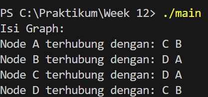
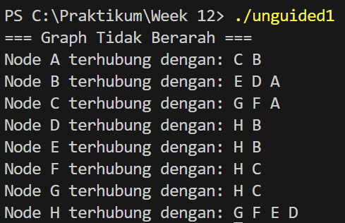
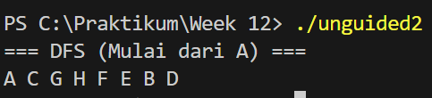
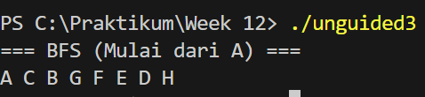

## 1. Nama, NIM, Kelas
- **Nama**: Muhammad Faozan Azril Zidan
- **NIM**: 103112430141
- **Kelas**: Struktur Data-05

## 2. Motivasi Belajar Struktur Data
Belajar struktur data itu sebenarnya bukan sekedar hafalan teori atau nulis kode. Intinya lebih ke melatih cara berpikir supaya rapi, masuk akal, dan efisien. Coba bayangin data itu kayak barang di gudang, kalau ditaruh asal-asalan pasti ribet nyarinya, tapi kalau disusun dengan sistem yang jelas, semuanya jadi gampang dan cepat ditemukan. Saat kita paham struktur data, kita punya modal penting buat nyelesain berbagai masalah, bukan cuma di pemrograman tapi juga di kehidupan sehari-hari, karena terbiasa mikir mencari solusi yang paling efektif. Jadi walaupun di awal terasa susah, anggap aja proses belajar ini sebagai investasi kecil yang nanti bakal sangat kepake saat menghadapi tantangan di dunia teknologi.

## 3. Dasar Teori

Struktur data adalah teknik untuk menyimpan dan mengatur data di dalam komputer supaya proses pengolahan dan pencariannya bisa berjalan lebih efektif. Salah satu materi dasar dalam struktur data adalah graph.

Graph dapat dipahami sebagai kumpulan elemen yang tidak kosong, yang terdiri dari simpul atau node (vertex) dan penghubung antar simpul yang disebut edge. Dalam kehidupan sehari-hari, graph bisa dianalogikan seperti peta: lokasi kost dan laboratorium berperan sebagai node, sedangkan jalan yang menghubungkan keduanya merupakan edge. Secara teknis dalam pemrograman, node utama menyimpan informasi data, sementara node anak atau edge berisi alamat memori yang menunjuk ke node lain sehingga membentuk hubungan antar data.

Dilihat dari arah hubungannya, graph dibagi menjadi dua jenis, yaitu graph berarah (directed graph) dan graph tidak berarah (undirected graph). Pada graph berarah, setiap edge memiliki arah tertentu, sehingga hubungan dari node A ke node B tidak selalu berarti ada hubungan dari B ke A. Sebaliknya, pada graph tidak berarah, hubungan antar node berlaku dua arah secara otomatis. Untuk merepresentasikan graph di dalam memori komputer, dapat digunakan matriks ketetanggaan berupa array dua dimensi atau struktur multi linked list. Dalam praktikum, multi linked list lebih sering digunakan karena bersifat dinamis dan lebih fleksibel dalam menangani penambahan maupun pengurangan data.

Konsep penting lain dalam graph adalah ketetanggaan, yaitu kondisi ketika dua node terhubung langsung oleh sebuah edge. Untuk menelusuri seluruh node dalam graph, digunakan algoritma penelusuran seperti Breadth First Search (BFS) dan Depth First Search (DFS). BFS melakukan penelusuran secara melebar berdasarkan level, dimulai dari node awal lalu dilanjutkan ke semua tetangganya. Sementara itu, DFS menelusuri graph dengan cara mendalami satu jalur terlebih dahulu hingga mencapai node terdalam sebelum kembali ke jalur sebelumnya.
## 4. Guided
### 4.1 Guided 1
```cpp
#ifndef SIMPLE_GRAPH_H
#define SIMPLE_GRAPH_H

#include <iostream>
using namespace std;

typedef char VertexInfo;

struct Vertex;
struct Edge;

typedef Vertex* VertexPtr;
typedef Edge* EdgePtr;

struct Edge {
    VertexPtr target;
    EdgePtr nextEdge;
};

struct Vertex {
    VertexInfo label;
    bool isVisited;
    EdgePtr edgeList;
    VertexPtr nextVertex;
};

struct SimpleGraph {
    VertexPtr head;
};

void initGraph(SimpleGraph &G);
VertexPtr createVertex(VertexInfo v);
void addVertex(SimpleGraph &G, VertexInfo v);

VertexPtr searchVertex(SimpleGraph &G, VertexInfo v);
void addEdge(SimpleGraph &G, VertexInfo from, VertexInfo to); 

void showGraph(SimpleGraph G);
void DFS(SimpleGraph G, VertexPtr start);
void BFS(SimpleGraph G, VertexPtr start);

#endif

```
Penjelasan : File graph.h digunakan sebagai header untuk mendefinisikan ADT dan deklarasi struktur data yang dipakai dalam merepresentasikan graph dengan pendekatan adjacency list atau senarai berantai. Di dalam file ini terdapat struktur data utama, yaitu ElmNode yang berfungsi sebagai simpul graph dan menyimpan data, penanda apakah simpul sudah dikunjungi (visited), pointer ke edge pertama, serta pointer ke simpul berikutnya. Selain itu ada ElmEdge yang merepresentasikan sisi atau hubungan antar simpul, yang berisi alamat simpul tujuan, serta struktur Graph yang menyimpan alamat simpul pertama dalam graph.  File ini juga mendefinisikan tipe pointer seperti adrNode dan adrEdge untuk mempermudah pengelolaan alamat memori. Tidak hanya itu, graph.h memuat deklarasi fungsi-fungsi dasar, seperti pembuatan graph, alokasi node, penambahan simpul (insertNode), penghubungan antar simpul (connectNode), hingga proses penelusuran graph menggunakan DFS dan BFS. Dengan adanya pemisahan antara deklarasi di file header dan implementasi di file sumber, program menjadi lebih rapi, terstruktur, dan mudah dikembangkan.


### 4.2 Guided 2
```cpp
#include "graph.h"

void createGraph(Graph &G) {
    G.first = nullptr;
}

adrNode allocateNode(infoGraph X) {
    adrNode nodeBaru = new ElmNode;

    nodeBaru->info = X;
    nodeBaru->visited = false;
    nodeBaru->firstEdge = nullptr;
    nodeBaru->next = nullptr;

    return nodeBaru;
}

void insertNode(Graph &G, infoGraph X) {
    adrNode nodeBaru = allocateNode(X);

    if (G.first == nullptr) {
        G.first = nodeBaru;
        return;
    }

    adrNode penunjuk = G.first;
    while (penunjuk->next != nullptr) {
        penunjuk = penunjuk->next;
    }

    penunjuk->next = nodeBaru;
}

```


Penjelasan :File graph_init.cpp berisi implementasi fungsi-fungsi dasar yang digunakan untuk menyiapkan struktur graph dan mengatur alokasi memori. Di dalamnya terdapat fungsi createGraph yang berperan menginisialisasi graph dengan mengatur pointer utama ke kondisi kosong (NULL). Selain itu, ada fungsi allocateNode yang digunakan untuk membuat simpul baru dengan memesan memori, mengisi data pada simpul tersebut, serta mengatur nilai awal atribut lain seperti visited yang diset menjadi false. File ini juga mengatur proses penambahan simpul ke dalam graph melalui fungsi insertNode. Prosesnya dilakukan dengan terlebih dahulu memanggil fungsi alokasi, lalu menelusuri daftar simpul yang sudah ada hingga mencapai simpul terakhir, dan kemudian menyambungkan simpul baru tersebut di bagian akhir. Dengan mekanisme ini, graph dapat menampung penambahan node secara dinamis sesuai kebutuhan.

```cpp
#include "graph.h"

adrNode findNode(Graph &G, infoGraph X) {
    adrNode current = G.first;

    while (current != nullptr) {
        if (current->info == X) {
            return current;
        }
        current = current->next;
    }
    return nullptr;
}

void connectNode(Graph &G, infoGraph N1, infoGraph N2) {
    adrNode nodeA = findNode(G, N1);
    adrNode nodeB = findNode(G, N2);

    if (nodeA == nullptr || nodeB == nullptr) {
        return;
    }

    adrEdge edgeAB = new ElmEdge;
    edgeAB->node = nodeB;
    edgeAB->next = nodeA->firstEdge;
    nodeA->firstEdge = edgeAB;

    adrEdge edgeBA = new ElmEdge;
    edgeBA->node = nodeA;
    edgeBA->next = nodeB->firstEdge;
    nodeB->firstEdge = edgeBA;
}

```


Penjelasan :File graph_edge.cpp berisi implementasi fungsi-fungsi yang mengatur dan memanipulasi hubungan antar simpul dalam graph. Prosesnya diawali dengan fungsi findNode, yang bekerja dengan menelusuri daftar simpul secara berurutan untuk menemukan alamat memori simpul berdasarkan nilai data yang dicari. Fungsi utama pada file ini adalah connectNode, yang berfungsi menghubungkan dua simpul yang valid. Cara kerjanya adalah dengan membuat elemen edge baru yang menyimpan pointer ke simpul tujuan. Secara teknis, edge tersebut disisipkan menggunakan metode insert first, yaitu menambahkan sisi baru di awal daftar ketetanggaan (firstEdge) milik simpul asal. Pendekatan ini membuat proses pembentukan relasi antar node menjadi lebih cepat dan efisien.


### 4.4 Guided 4

```cpp
#include "graph.h"
#include <queue>
#include <iostream>
using namespace std;

void showGraph(Graph G) {
    adrNode nodePtr = G.first;
    while (nodePtr != nullptr) {
        cout << "Node " << nodePtr->info << " terhubung dengan: ";
        adrEdge edgePtr = nodePtr->firstEdge;
        while (edgePtr != nullptr) {
            cout << edgePtr->node->info << " ";
            edgePtr = edgePtr->next;
        }
        cout << endl;
        nodePtr = nodePtr->next;
    }
}

void clearVisited(Graph &G) {
    adrNode nodePtr = G.first;
    while (nodePtr != nullptr) {
        nodePtr->visited = false;
        nodePtr = nodePtr->next;
    }
}

void dfsTraverse(adrNode node) {
    if (!node || node->visited) return;

    node->visited = true;
    cout << node->info << " ";

    for (adrEdge edgePtr = node->firstEdge; edgePtr != nullptr; edgePtr = edgePtr->next) {
        if (!edgePtr->node->visited) {
            dfsTraverse(edgePtr->node);
        }
    }
}

void traverseDFS(Graph G, adrNode start) {
    clearVisited(G);
    dfsTraverse(start);
}

void traverseBFS(Graph G, adrNode start) {
    clearVisited(G);
    if (!start) return;

    queue<adrNode> q;
    q.push(start);
    start->visited = true;

    while (!q.empty()) {
        adrNode current = q.front();
        q.pop();
        cout << current->info << " ";

        for (adrEdge edgePtr = current->firstEdge; edgePtr != nullptr; edgePtr = edgePtr->next) {
            if (!edgePtr->node->visited) {
                edgePtr->node->visited = true;
                q.push(edgePtr->node);
            }
        }
    }
}

```


Penjelasan :File graph_print.cpp berfungsi untuk menampilkan atau memvisualisasikan struktur graph ke layar konsol. Di dalam file ini, terdapat fungsi utama bernama printGraph yang bertugas mencetak daftar simpul beserta hubungan ketetanggaannya. Cara kerja fungsi ini menggunakan perulangan bersarang. Perulangan luar digunakan untuk menelusuri setiap simpul dalam daftar utama secara berurutan, sedangkan perulangan dalam digunakan untuk menelusuri semua sisi yang terhubung dengan simpul tersebut. Dengan memanfaatkan pointer firstEdge pada simpul yang sedang diproses, fungsi printGraph dapat menampilkan informasi simpul utama lalu diikuti oleh daftar simpul lain yang terhubung dengannya. Hasilnya adalah tampilan teks yang memperlihatkan struktur adjacency list dari graph secara jelas dan mudah dipahami.

### 4.5 Guided 5

```cpp
#include "graph.h"
#include <iostream>

using namespace std;

int main() {
    Graph myGraph;
    createGraph(myGraph);

    insertNode(myGraph, 'A');
    insertNode(myGraph, 'B');
    insertNode(myGraph, 'C');
    insertNode(myGraph, 'D');

    connectNode(myGraph, 'A', 'B');
    connectNode(myGraph, 'A', 'C');
    connectNode(myGraph, 'B', 'D');
    connectNode(myGraph, 'C', 'D');

    cout << "Struktur Graph:" << endl;
    showGraph(myGraph); 

    cout << "\nDFS mulai dari node A: ";
    traverseDFS(myGraph, findNode(myGraph, 'A'));

    cout << "\nBFS mulai dari node A: ";
    traverseBFS(myGraph, findNode(myGraph, 'A'));

    cout << endl;
    return 0;
}

```


Penjelasan :File main.cpp berfungsi sebagai program utama atau driver yang menggabungkan sekaligus menguji seluruh fitur ADT Graph yang telah dideklarasikan pada file header. Alur program dimulai dengan mendeklarasikan sebuah variabel bertipe Graph, kemudian melakukan inisialisasi awal menggunakan fungsi createGraph. Setelah graph siap digunakan, proses dilanjutkan dengan menambahkan simpul-simpul ke dalam struktur data melalui fungsi insertNode, misalnya dengan memasukkan data dari karakter ‘A’ sampai ‘D’. Berikutnya, program membentuk hubungan antar simpul dengan memanggil fungsi connectNode sesuai dengan topologi graph yang diinginkan. Terakhir, fungsi printGraph dipanggil untuk menampilkan struktur graph yang telah terbentuk ke layar konsol, sehingga pengguna dapat memastikan bahwa hubungan antar node sudah sesuai dengan logika yang diharapkan.

Output : 
## 5. Unguided
### 5.1 Unguided 1
```cpp
#include "graph.h"
#include <iostream>
using namespace std;

int main() {
    Graph myGraph;
    createGraph(myGraph);

    insertNode(myGraph, 'A'); insertNode(myGraph, 'B'); insertNode(myGraph, 'C');
    insertNode(myGraph, 'D'); insertNode(myGraph, 'E'); insertNode(myGraph, 'F');
    insertNode(myGraph, 'G'); insertNode(myGraph, 'H');

    connectNode(myGraph, 'A', 'B'); connectNode(myGraph, 'A', 'C');
    connectNode(myGraph, 'B', 'D'); connectNode(myGraph, 'B', 'E');
    connectNode(myGraph, 'C', 'F'); connectNode(myGraph, 'C', 'G');
    connectNode(myGraph, 'D', 'H'); connectNode(myGraph, 'E', 'H');
    connectNode(myGraph, 'F', 'H'); connectNode(myGraph, 'G', 'H');

    cout << "=== Struktur Graph (Tak Berarah) ===" << endl;
    showGraph(myGraph);  

    cout << "\nDFS mulai dari node A: ";
    traverseDFS(myGraph, findNode(myGraph, 'A'));

    cout << "\nBFS mulai dari node A: ";
    traverseBFS(myGraph, findNode(myGraph, 'A'));

    cout << endl;
    return 0;
}

```

Penjelasan :

Unguided 1 pada dasarnya meminta kita untuk memodifikasi program graph yang awalnya bersifat satu arah menjadi graph dua arah atau tidak berarah (undirected graph). Jika pada latihan sebelumnya hubungan antar node hanya berjalan searah—misalnya dari A ke B belum tentu bisa kembali dari B ke A—maka pada tugas ini setiap hubungan harus berlaku timbal balik. Artinya, ketika A terhubung ke B, maka B juga otomatis terhubung ke A. Untuk mengerjakan tugas ini, fokus utama ada pada perubahan fungsi connectNode. Logika program perlu disesuaikan agar setiap kali dua node dihubungkan, sistem langsung membentuk dua edge sekaligus: satu dari node asal ke node tujuan, dan satu lagi dari node tujuan kembali ke node asal. Node-node yang disusun, mulai dari A hingga H sesuai dengan gambar pada modul, kemudian dihubungkan berdasarkan ketentuan tersebut. Setelah program dijalankan, hasil keluaran dari fungsi print akan menampilkan daftar simpul yang saling terhubung dua arah, sehingga terlihat jelas bahwa graph sudah berhasil dibuat tidak berarah sesuai dengan permintaan soal.

Output : 


### 5.2 Unguided 2
```cpp
#include "graph.h"
#include <iostream>
using namespace std;

int main() {
    Graph myGraph;
    createGraph(myGraph);

    insertNode(myGraph, 'A'); insertNode(myGraph, 'B'); insertNode(myGraph, 'C');
    insertNode(myGraph, 'D'); insertNode(myGraph, 'E'); insertNode(myGraph, 'F');
    insertNode(myGraph, 'G'); insertNode(myGraph, 'H');

    connectNode(myGraph, 'A', 'B'); connectNode(myGraph, 'A', 'C');
    connectNode(myGraph, 'B', 'D'); connectNode(myGraph, 'B', 'E');
    connectNode(myGraph, 'C', 'F'); connectNode(myGraph, 'C', 'G');
    connectNode(myGraph, 'D', 'H'); connectNode(myGraph, 'E', 'H');
    connectNode(myGraph, 'F', 'H'); connectNode(myGraph, 'G', 'H');

    cout << "=== Hasil DFS Mulai dari Node A ===" << endl;
    adrNode startingNode = findNode(myGraph, 'A');
    traverseDFS(myGraph, startingNode); 
    cout << endl;

    return 0;
}

```

Penjelasan :Unguided 2 menugaskan kita untuk menambahkan fitur penelusuran graph menggunakan metode Depth First Search (DFS). Kalau pada latihan sebelumnya kita hanya membuat hubungan atau “jalan” antar node, pada tugas ini fokusnya adalah bagaimana program bisa menelusuri jalan-jalan tersebut secara berurutan dari titik awal. Cara kerja DFS bisa dibayangkan seperti seseorang yang menjelajahi labirin. Ia akan memilih satu jalur dan terus berjalan sedalam mungkin sampai tidak ada jalan lagi. Setelah itu, ia akan kembali ke persimpangan sebelumnya untuk mencoba jalur lain yang belum dilewati. Pola inilah yang diterapkan dalam algoritma DFS. Dalam implementasinya, DFS biasanya dibuat menggunakan teknik rekursif, di mana sebuah fungsi memanggil dirinya sendiri untuk berpindah dari satu node ke node tetangga yang lebih dalam. Hal penting yang harus diperhatikan adalah pemberian penanda pada setiap node yang sudah dikunjungi melalui variabel visited. Dengan cara ini, program tidak akan mengunjungi node yang sama berulang kali. Output dari program nantinya berupa urutan huruf yang ditampilkan di layar, yang menunjukkan jalannya penelusuran DFS dari node awal ke node-node lain yang berhasil dijelajahi.

Output : 

### 5.3 Unguided 3
```cpp
#include "graph.h"
#include <iostream>
using namespace std;

int main() {
    Graph myGraph;
    createGraph(myGraph);

    insertNode(myGraph, 'A'); insertNode(myGraph, 'B'); insertNode(myGraph, 'C');
    insertNode(myGraph, 'D'); insertNode(myGraph, 'E'); insertNode(myGraph, 'F');
    insertNode(myGraph, 'G'); insertNode(myGraph, 'H');

    connectNode(myGraph, 'A', 'B'); connectNode(myGraph, 'A', 'C');
    connectNode(myGraph, 'B', 'D'); connectNode(myGraph, 'B', 'E');
    connectNode(myGraph, 'C', 'F'); connectNode(myGraph, 'C', 'G');
    connectNode(myGraph, 'D', 'H'); connectNode(myGraph, 'E', 'H');
    connectNode(myGraph, 'F', 'H'); connectNode(myGraph, 'G', 'H');

    cout << "=== BFS (mulai dari A) ===" << endl;
    adrNode start = findNode(myGraph, 'A');
    traverseBFS(myGraph, start); 
    cout << endl;

    return 0;
}

```

Penjelasan :Unguided 3 mengharuskan kita membuat fitur penelusuran graph dengan metode Breadth First Search (BFS). Berbeda dengan DFS yang langsung menelusuri satu jalur sedalam mungkin, BFS bekerja dengan cara menyebar secara bertahap berdasarkan tingkat atau level. Prosesnya bisa dibayangkan seperti gelombang air di kolam setelah dilempar batu, di mana penyebaran dimulai dari titik awal lalu merata ke semua node terdekat terlebih dahulu sebelum melanjutkan ke node yang lebih jauh. Dalam penerapannya, BFS memanfaatkan struktur data Queue atau antrean. Mekanismenya mirip seperti antrean pada loket, di mana node yang masuk lebih dulu akan diproses lebih dulu. Ketika sebuah node diambil dari depan antrean dan diproses, seluruh node tetangganya akan dimasukkan ke bagian belakang antrean. Proses ini terus berulang sampai antrean kosong. Selama penelusuran berlangsung, setiap node yang sudah dikunjungi akan diberi tanda, sehingga tidak ada node yang diproses atau dimasukkan ke antrean lebih dari satu kali.

Output : 


## 6. Kesimpulan
Penggunaan struktur data graph dengan pendekatan adjacency list terbukti cukup efektif karena bersifat dinamis dan tidak bergantung pada alokasi memori yang kaku. Dengan metode ini, hubungan antar simpul dapat dibentuk dan dikembangkan sesuai kebutuhan. Dalam praktikum, perbedaan yang paling menonjol terletak pada perubahan logika penghubung, di mana graph yang awalnya bersifat satu arah (directed graph) dikembangkan menjadi graph dua arah atau timbal balik (undirected graph). Perubahan ini memastikan bahwa setiap hubungan antar node memiliki jalur kembali secara otomatis. Pemahaman terhadap konsep graph semakin diperdalam melalui penerapan algoritma penelusuran. Algoritma DFS digunakan untuk menjelajahi graph dengan menelusuri satu jalur hingga ke bagian terdalam secara rekursif, sedangkan BFS bekerja dengan cara menyebar ke setiap level menggunakan struktur antrean. Secara keseluruhan, penerapan ini menunjukkan bagaimana struktur data yang kompleks dapat diatur dan ditelusuri dengan rapi serta sistematis.

## 7. Referensi
1. **Tim Dosen Kuwu** (2025) _Draft Modul Praktikum Struktur Data: Graph._ Bandung: School of Computing, Telkom University .