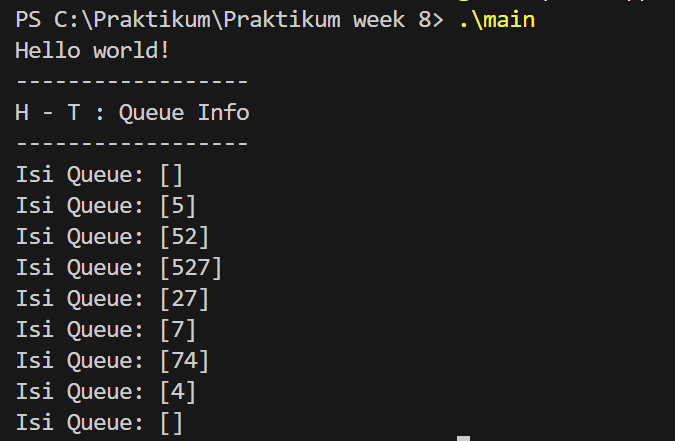
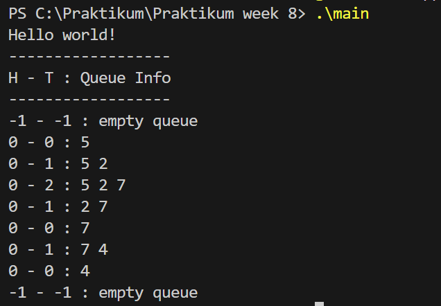
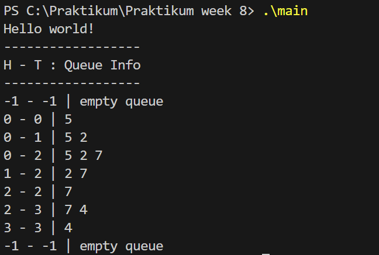
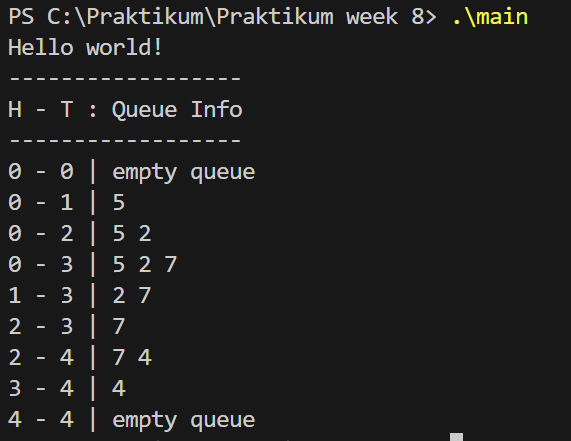

## 1. Nama, NIM, Kelas
- **Nama**: Muhammad Faozan Azril Zidan
- **NIM**: 103112430141
- **Kelas**: 12-IF-05

## 2. Motivasi Belajar Struktur Data
Belajar struktur data itu penting supaya kita tidak cuma bisa bikin program jalan, tapi juga rapi dan efisien. Memang di awal terasa ribet dan bikin pusing, tapi itu wajar. Lewat struktur data, cara berpikir jadi lebih logis dan teratur, dan konsep yang awalnya susah lama-lama bakal masuk akal. Jangan takut salah, karena dari situ proses belajar terjadi. Tetap konsisten dan sering latihan, karena kalau struktur data sudah dipahami, ngoding bakal terasa lebih mudah dan bikin lebih percaya diri.

## 3. Dasar Teori

Struktur data merupakan teknik untuk menyimpan dan mengatur data di dalam komputer supaya proses pengolahan data dapat dilakukan dengan lebih efektif. Salah satu struktur data dasar yang sering digunakan adalah Queue.
Queue atau antrean adalah struktur data linier yang mengikuti aturan FIFO (First In, First Out), yaitu data yang pertama masuk akan menjadi data yang pertama keluar. Konsep ini mirip dengan antrean di kehidupan sehari-hari, seperti antrean di kasir. Dalam queue, penambahan data dilakukan di bagian belakang yang disebut tail melalui operasi enqueue, sedangkan penghapusan data dilakukan di bagian depan yang disebut head melalui operasi dequeue.
Antrean dapat diimplementasikan menggunakan array. Pada implementasi ini, array berfungsi sebagai tempat penyimpanan data, sementara dua variabel, head dan tail, digunakan untuk menandai posisi elemen terdepan dan terbelakang. Pada implementasi paling sederhana atau metode naif, head selalu berada di indeks 0 selama antrean tidak kosong. Cara ini membuat proses enqueue cukup mudah, tetapi dequeue menjadi tidak efisien karena setiap penghapusan elemen mengharuskan semua data lainnya digeser ke kiri.
Untuk meningkatkan efisiensi, digunakan metode kedua, di mana elemen tidak lagi digeser saat dequeue. Sebagai gantinya, nilai head digeser maju ke indeks berikutnya. Metode ini membuat dequeue lebih cepat, tetapi menimbulkan masalah penuh semu, yaitu kondisi ketika tail sudah berada di akhir array sementara masih ada ruang kosong di awal array yang tidak bisa dimanfaatkan.
Masalah tersebut diselesaikan dengan metode circular queue. Pada metode ini, array diperlakukan seolah-olah berbentuk melingkar. Ketika head atau tail mencapai indeks terakhir, posisi berikutnya akan kembali ke indeks awal dengan bantuan operasi modulo. Dengan pendekatan ini, ruang array dapat dimanfaatkan secara maksimal dan operasi enqueue maupun dequeue menjadi jauh lebih efisien.
## 4. Guided
### 4.1 Guided 1
```cpp
#ifndef QUEUE_H
#define QUEUE_H

#include <iostream>
using namespace std;

#define MAX_QUEUE 5
typedef int infotype;

struct Queue {
    infotype info[MAX_QUEUE];
    int head;
    int tail;
    int count;
};

void createQueue(Queue &Q);
bool isEmptyQueue(Queue Q);
bool isFullQueue(Queue Q);
void enqueue(Queue &Q, infotype x);
infotype dequeue(Queue &Q);
void printInfo(Queue Q);

#endif
```
Penjelasan : File header queue.h berfungsi sebagai dasar atau cetak biru struktur data Antrean (Queue). Di dalamnya ditetapkan ukuran maksimum antrean sebanyak 5 elemen melalui MAX_QUEUE, serta infotype sebagai alias dari tipe data int. File ini mendefinisikan struct Queue yang berisi array untuk menyimpan data dan variabel head serta tail sebagai penunjuk posisi, sekaligus mendeklarasikan prototipe fungsi seperti createQueue, enqueue, dan dequeue, sementara implementasi fungsinya diletakkan pada file .cpp terpisah.


### 4.2 Guided 2
```cpp
#include "queue.h"
#include <iostream>
using namespace std;

void createQueue(Queue &Q) {
    Q.head = 0;
    Q.tail = 0;
    Q.count = 0;
}

bool isEmpty(Queue Q) {
    return Q.count == 0;
}

bool isFull(Queue Q) {
    return Q.count == MAX_QUEUE;
}

void enqueue(Queue &Q, int x) {
    if (!isFull(Q)) {
        Q.info[Q.tail] = x;
        Q.tail = (Q.tail + 1) % MAX_QUEUE;
        Q.count++;
    } else {
        cout << "Antrean Penuh!" << endl;
    }
}

int dequeue(Queue &Q) {
    if (!isEmpty(Q)) {
        int x = Q.info[Q.head];
        Q.head = (Q.head + 1) % MAX_QUEUE;
        Q.count--;
        return x;
    } else {
        cout << "Antrean Kosong!" << endl;
        return -1;
    }
}

void printInfo(Queue Q) {
    cout << "Isi Queue: [";
    if(!isEmpty (Q)){
        int i = Q.head;
        int n = 0;
        while (n < Q.count) {
            cout << Q.info[i];
            i = (i + 1) % MAX_QUEUE;
            n++;
    }
 }
    cout << "]" << endl;
}
```


Penjelasan :Kode diatas mengimplementasikan Circular Queue menggunakan variabel count agar pengelolaan antrean lebih efisien. Variabel count memudahkan pengecekan kondisi kosong dan penuh. Fungsi createQueue mengatur head, tail, dan count ke 0, enqueue menambahkan data secara melingkar dan menaikkan count, sedangkan dequeue mengambil data, menggeser head, dan mengurangi count. Fungsi printInfo menampilkan isi antrean dengan perulangan sebanyak count mulai dari head.

### 4.3 Guided 3

```cpp
#include <iostream>
#include "queue.h"
using namespace std;

int main() {
    cout << "Hello world!" << endl;
    Queue Q;
    cout << "------------------" << endl;
    cout << "H - T : Queue Info" << endl;
    cout << "------------------" << endl;

    createQueue(Q);
    printInfo(Q);

    enqueue(Q, 5);
    printInfo(Q);  

    enqueue(Q, 2);
    printInfo(Q);  

    enqueue(Q, 7);
    printInfo(Q);  

    dequeue(Q);
    printInfo(Q);

    dequeue(Q);
    printInfo(Q);

    enqueue(Q, 4);
    printInfo(Q);  

    dequeue(Q);
    printInfo(Q);

    dequeue(Q);
    printInfo(Q);

    return 0;

}
```


Penjelasan :File main.cpp digunakan untuk menguji kinerja Antrean (Queue). Program menginisialisasi antrean kosong, menambahkan beberapa elemen, melakukan operasi dequeue dan enqueue secara bergantian, lalu mengosongkan antrean. Setiap langkah menampilkan kondisi antrean sehingga perubahan head, tail, dan isi queue dapat dipantau.
Output : 



## 5. Unguided
### 5.1 Unguided 1
```cpp
#include "queue.h"

void createQueue(Queue &Q) {
    Q.head = -1;
    Q.tail = -1;
}

bool isEmptyQueue(Queue Q) {
    return Q.tail == -1;
}

bool isFullQueue(Queue Q) {
    return Q.tail == MAX_QUEUE - 1;
}

void enqueue(Queue &Q, infotype x) {
    if (isFullQueue(Q)) {
        cout << "Antrean Penuh!" << endl;
    } else {
        if (isEmptyQueue(Q)) {
            Q.head = 0;
        }
        Q.tail++;
        Q.info[Q.tail] = x;
    }
}

infotype dequeue(Queue &Q) {
    if (isEmptyQueue(Q)) {
        cout << "Antrean Kosong!" << endl;
        return -1;
    } else {
        infotype x = Q.info[Q.head];
        for (int i = Q.head; i < Q.tail; i++) {
            Q.info[i] = Q.info[i + 1];
        }
        Q.tail--;
        if (Q.tail == -1) {
            Q.head = -1;    
        }
        return x;
    }
}

void printInfo(Queue Q) {
    cout << Q.head << " - " << Q.tail << " : ";
    if (isEmptyQueue(Q)) {
        cout << "empty queue" << endl;
    } else {
        for (int i = Q.head; i <= Q.tail; i++) {
            cout << Q.info[i];
            if (i < Q.tail) {
                cout << " ";
            }
        }
        cout << endl;
    }
}
```

Penjelasan ::Kode diatas mengimplementasikan Antrean Naif (Alternatif 1) dengan head selalu di indeks 0. Antrean diinisialisasi kosong dengan head dan tail bernilai -1. Operasi enqueue menambah elemen di belakang antrean, sedangkan dequeue mengambil elemen depan dan menggeser seluruh elemen lain ke kiri, sehingga kurang efisien. Fungsi printInfo menampilkan kondisi head, tail, dan isi antrean atau pesan jika antrean kosong.

Output : 



### 5.1 Unguided 2
```cpp
#include "stack.h"
#include <iostream>
using namespace std;

int main() {
    cout << "Hello World!" << endl;
    Stack S;
    CreateStack(S);
    pushAscending(S, 4);
    pushAscending(S, 5);
    pushAscending(S, 9);
    pushAscending(S, 3);
    pushAscending(S, 4);
    pushAscending(S, 10);
    printInfo(S);
    cout << "balik stack" << endl;
    balikStack(S);
    printInfo(S);
    return 0;
}
```

Penjelasan ::Kode diatas menerapkan Alternatif 2 (Antrean Geser) yang membuat operasi dequeue lebih efisien karena hanya memajukan head tanpa menggeser elemen. Antrean diinisialisasi dengan head dan tail bernilai -1, kondisi kosong dicek dari posisi head dan tail, dan kondisi penuh terjadi saat tail mencapai batas array sehingga bisa muncul penuh semu. Operasi enqueue menambah data di belakang antrean, sedangkan dequeue mengambil data depan dengan menggeser head.

Output : 



### 5.1 Unguided 3
```cpp
#include "queue.h"

void createQueue(Queue &Q) {
    Q.head = 0;
    Q.tail = 0;
}

bool isEmptyQueue(Queue Q) {
    return Q.head == Q.tail;
}

bool isFullQueue(Queue Q) {
    return (Q.tail + 1) % MAX_QUEUE == Q.head;
}

void enqueue(Queue &Q, infotype x) {
    if (isFullQueue(Q)) {
        cout << "Antrean Penuh!" << endl;
    } else {
        Q.info[Q.tail] = x;
        Q.tail = (Q.tail + 1) % MAX_QUEUE;
    }
}

infotype dequeue(Queue &Q) {
    if (isEmptyQueue(Q)) {
        cout << "Antrean Kosong!" << endl;
        return -1;
    } else {
        infotype x = Q.info[Q.head];
        Q.head = (Q.head + 1) % MAX_QUEUE;
        return x;
    }
}

void printInfo(Queue Q) {
    cout << Q.head << " - " << Q.tail << " | ";
    if (isEmptyQueue(Q)) {
        cout << "empty queue" << endl;
    } else {
        int i = Q.head;
        while (i != Q.tail) {
            cout << Q.info[i] << " ";
            i = (i + 1) % MAX_QUEUE;
        }
        cout << endl;
    }
}
```

Penjelasan :Kode diatas mengimplementasikan Alternatif 3 (Circular Queue) yang paling efisien karena array diperlakukan melingkar sehingga tidak ada pergeseran data dan tidak terjadi penuh semu. Antrean kosong saat head sama dengan tail, dan penuh saat tail berada satu langkah sebelum head secara melingkar. Operasi enqueue dan dequeue memajukan tail dan head menggunakan modulo, sementara printInfo menampilkan isi antrean dengan penelusuran melingkar dari head ke tail.

Output : 


## 6. Kesimpulan
Kesimpulannya, antrean berbasis array dapat diimplementasikan dengan beberapa cara. Alternatif 1 mudah dipahami tetapi tidak efisien karena dequeue harus menggeser data. Alternatif 2 membuat dequeue lebih cepat dengan menggeser head, namun menimbulkan masalah penuh semu. Alternatif 3 (Circular Queue) adalah solusi paling efisien karena memanfaatkan array secara melingkar, menghilangkan penuh semu, dan menjaga operasi enqueue serta dequeue tetap optimal.

## 7. Referensi
1. [https://www.dicoding.com/blog/struktur-data-queue-pengertian-fungsi-dan-jenisnya/](https://www.dicoding.com/blog/struktur-data-queue-pengertian-fungsi-dan-jenisnya/)