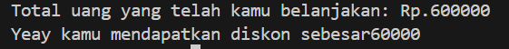

## 1. Nama, NIM, Kelas
- **Nama**: Muhammad Faozan Azril Zidan
- **NIM**: 103112430141
- **Kelas**: Struktur Data-05

## 2. Motivasi Belajar Struktur Data
Belajar struktur data itu ibarat belajar cara menata barang di gudang. Kalo barang ditumpuk sembarangan, pasti susah dicari, makan tempat, dan bikin ribet. Tapi kalo ditata rapi dengan sistem (pakai rak, label, urutan), semua jadi lebih mudah, cepat, dan efisien.

## 3. Dasar Teori

Struktur data adalah cara untuk menyimpan dan mengorganisir data dalam komputer agar dapat digunakan secara efisien. Berikut adalah teori dasar mengenai Loop, Increment, dan If:

- **Operasi Aritmetika pada Bilangan Float** Dalam pemrograman, operasi aritmetika seperti penjumlahan, pengurangan, perkalian, dan pembagian merupakan konsep paling dasar yang hampir selalu digunakan. Di C++, operasi tersebut dapat dilakukan menggunakan operator bawaan `+`, `-`, `*`, dan `/` baik pada bilangan bulat maupun pecahan (float). Tipe data `float` memungkinkan komputer menyimpan dan mengolah bilangan desimal dengan presisi tertentu sehingga hasil perhitungan lebih akurat.
    
- **Konversi Angka ke Bentuk Kata (Number to Words)** Konversi angka ke kata merupakan implementasi dari pemetaan data (mapping) dan percabangan logika. Proses ini biasanya dilakukan dengan mengelompokkan angka dalam satuan, belasan, puluhan, hingga ratusan, kemudian diterjemahkan ke dalam teks sesuai aturan bahasa. 
    
- **Pola Mirror dan Perulangan Bersarang (Nested Loop)** Konsep ini mengasah kemampuan mahasiswa untuk menggunakan struktur perulangan bersarang (nested loop) dengan tepat, sekaligus melatih ketelitian dalam mengatur spasi, urutan angka, dan simbol agar pola sesuai dengan yang diharapkan.

## 4. Guided
### 4.1 Guided 1
```cpp
#include <iostream>

  

using namespace std;

  

int main() {

    double total_pembelian, diskon;

    cout << "Uang yang telah kamu belanjakan: Rp.";

    cin >> total_pembelian;

    if(total_pembelian >= 40000) {

        diskon = 0.1 * total_pembelian;

        cout << "Kamu dapat diskon sebesar " << diskon <<

    } else {

        cout << "Maaf kamu belum bisa mendapatan diskon, karena total belanja kamu belum memenuhi minimal diskon";

    }

}
```
Penjelasan : Program diatas digunakan untuk menghitung diskon belanja. Pengguna memasukkan total belanja, lalu program memeriksa apakah nilainya minimal Rp40.000. Jika ya, maka diberikan diskon 10% dari total belanja dan hasilnya ditampilkan. Jika tidak, program hanya menampilkan pesan bahwa jumlah belanja belum cukup untuk mendapatkan diskon.

Output : 


### 4.2 Guided 2
```cpp
#include <iostream>

  

using namespace std;

int main(){

    float celcius, fahrenheit;

    cout << "dingin kamu berapa derajat:";

    cin >> celcius;

    fahrenheit = (9.0/5.0) * celcius + 32;

    cout << "setara dinginnya : " << fahrenheit << " derajat fahrenheit" << endl;

    cout << "terlalu dingin";

    return 0;

}
```


Penjelasan : Program diatas berfungsi untuk mengubah suhu dari Celcius ke Fahrenheit. Pertama, dibuat dua variabel `float`: `celcius` untuk menampung input pengguna dan `fahrenheit` untuk hasil konversi. Setelah pengguna memasukkan suhu dalam Celcius lewat `cin`, program menghitungnya dengan rumus `(9.0/5.0) * celcius + 32`. Nilai yang diperoleh kemudian disimpan ke variabel `fahrenheit` dan ditampilkan ke layar dalam bentuk derajat Fahrenheit.

Output : 

![[2.png]]

### 4.3 Guided 3

```cpp
#include <iostream>

  

using namespace std;

int main() {

    int a = 20;

    int b;

  

    b = 20 + ++a;

    cout << "Nilai a: " << a << endl;

    cout << "Nilai b: " << b << endl;

    return 0;

}
```


Penjelasan : Program diatas memperlihatkan cara kerja operator **prefix increment (++r)**. Awalnya, variabel `r` diberi nilai 20, lalu `s` dideklarasikan tanpa nilai awal. Saat baris `s = 20 + ++r;` dijalankan, `r` dinaikkan dulu menjadi 21, lalu dipakai dalam perhitungan. Hasilnya, `s` bernilai 41 dan `r` bernilai 21. Kedua nilai tersebut kemudian ditampilkan ke layar dengan `cout`.

Output : 

![[3.png]]


## 5. Unguided
### 5.1 Unguided 1
```cpp
#include <iostream>

using namespace std;

  

int main(){

    float x, y;

    cin >> x >> y;

    cout << x + y << endl;

    cout << x - y << endl;

    cout << x * y << endl;

    if(y != 0)

        cout << x / y << endl;

    else

        cout << "Error" << endl;

    return 0;

}
```

Penjelasan : Program diatas menunjukkan cara melakukan operasi aritmatika dasar dengan dua bilangan bertipe float. Pertama, variabel **a** dan **b** dideklarasikan, lalu pengguna diminta memasukkan nilainya melalui **cin**. Setelah itu, program menampilkan hasil penjumlahan, pengurangan, serta perkalian. Untuk pembagian, digunakan kondisi **if-else** agar tidak terjadi pembagian dengan nol. Jika **b ≠ 0**, maka hasil **a/b** ditampilkan, sedangkan jika **b = 0**, program akan menampilkan pesan **"Error"**.

Output : 
![[4.png]]


### 5.2 Unguided 2
```cpp
#include <iostream>

using namespace std;

  

int main(){

    string satuan[]={"nol","satu","dua","tiga","empat","lima","enam","tujuh","delapan","sembilan"};

    string belasan[]={"sepuluh","sebelas","dua belas","tiga belas","empat belas","lima belas","enam belas","tujuh belas","delapan belas","sembilan belas"};

    string puluhan[]={"","", "dua puluh","tiga puluh","empat puluh","lima puluh","enam puluh","tujuh puluh","delapan puluh","sembilan puluh"};

  

    int n;

    cin >> n;

    if(n<0 || n>100)

        cout << "error";

    else if(n < 10)

        cout << satuan[n];

    else if(n < 20)

        cout << belasan[n-10];

    else if(n < 100){

        cout << puluhan[n/10];

        if(n % 10 != 0)

            cout << " " << satuan[n%10];

    }else

        cout << "seratus";

  

    return 0;

}
```

Penjelasan : Program diatas digunakan untuk mengubah angka menjadi tulisan dalam bahasa Indonesia. Ada tiga array string yang disiapkan: **satuan** (0–9), **belasan** (10–19), dan **puluhan** (20–90). Setelah pengguna memasukkan sebuah angka `n`, program akan memeriksa kondisinya. Jika `n` kurang dari 0 atau lebih dari 100, akan muncul pesan “error”. Angka 0–9 langsung diambil dari array satuan, angka 10–19 dari array belasan, sedangkan angka 20–99 diambil dari array puluhan dengan tambahan satuan jika tidak habis dibagi 10. Khusus angka 100, program langsung menampilkan kata “seratus”.

Output : 
![[5.png]]
### 5.3 Unguided 3

```cpp
#include <iostream>

using namespace std;

  

int main(){

    int n;

    cin >> n;

  

    for(int i=n; i>=1; i--){

        for(int s=0; s<n-i; s++) cout<<" ";

        for(int j=i; j>=1; j--) cout<<j<<" ";

        cout<<"* ";

        for(int j=1; j<=i; j++) cout<<j<<" ";

        cout<<endl;

    }

    for(int s=0; s<n; s++) cout<<" ";

    cout<<"*"<<endl;

  

    return 0;

}
```


Penjelasan : Program diatas berfungsi menampilkan pola segitiga simetris dengan angka dan tanda bintang (_). Pertama, pengguna diminta memasukkan sebuah bilangan bulat n sebagai tinggi segitiga. Proses utama dilakukan dengan perulangan bersarang. Perulangan luar mengatur jumlah baris dari n hingga 1. Di dalamnya, ada tiga langkah: mencetak spasi untuk menjaga kerapihan, menampilkan angka menurun dari i ke 1, mencetak simbol * di tengah, lalu melanjutkan dengan angka naik dari 1 ke i. Setelah itu, baris ditutup dengan endl. Sebagai penutup, program menambahkan satu baris terakhir berupa spasi sebanyak n dan sebuah bintang (_) di bagian bawah sebagai alas segitiga.

Output : 
![[6.png]]

## 6. Kesimpulan
Dari berbagai program yang sudah dibuat, saya jadi lebih paham bagaimana dasar-dasar C++ bisa dipakai untuk menyelesaikan masalah sederhana. Mulai dari menghitung diskon, mengonversi suhu, operasi aritmatika, penggunaan increment, sampai mengubah angka jadi teks atau pola bintang, semuanya menunjukkan bahwa logika pemrograman saling berkaitan. Konsep seperti input-output, percabangan, perulangan, dan array menjadi pondasi utama dalam membangun solusi. Melalui latihan-latihan ini, saya semakin yakin bahwa menguasai dasar sangat penting sebelum masuk ke materi yang lebih rumit seperti struktur data atau algoritma. Selain itu, saya juga menyadari bahwa logika yang kreatif bisa membuat program lebih menarik dan mudah dipahami. Jadi, pembelajaran ini bukan hanya soal menulis kode, tapi juga melatih cara berpikir sistematis untuk menyelesaikan masalah.

## 7. Referensi
1. [https://dte.telkomuniversity.ac.id/struktur-data-dasar-array-linked-list-stack-dan-queue/](https://dte.telkomuniversity.ac.id/struktur-data-dasar-array-linked-list-stack-dan-queue/)
2. [https://www.trivusi.web.id/2022/06/mengenal-struktur-data.html](https://www.trivusi.web.id/2022/06/mengenal-struktur-data.html)