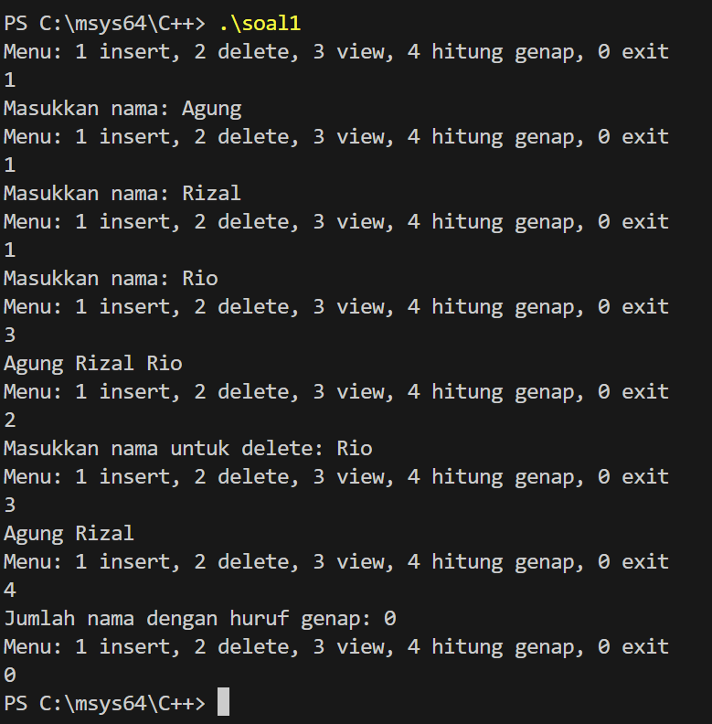

SINGLY LINKED LIST SOAL 1

Identitas Pengumpul

Nama: Muhammad Faozan Azril Zidan

NIM: 103112430141

Kelas: 12-IF-05

1. Kode Program

Berikut adalah kode program untuk mengimplementasikan single linked list

(Silakan ganti bahasa dan kode di bawah ini sesuai tugas Anda)

```File: soal1.cpp
 * Author: Muhammad Faozan Azril Zidan
 * NIM: 103112430141
 * Deskripsi:Program soal1.cpp adalah program C++ yang menggunakan Singly Linked List untuk menyimpan nama mahasiswa, dengan fitur menambah nama, menghapus nama, menampilkan seluruh nama, serta menghitung jumlah nama yang memiliki huruf genap melalui menu interaktif.
 */

#include <iostream>
#include <string>
using namespace std;

struct Node {
    string nama;
    Node* next;
};

Node* head = nullptr;

// Insert di akhir list
void insertAkhir(string nama) {
    Node* baru = new Node{nama, nullptr};

    if (head == nullptr) {
        head = baru;
    } else {
        Node* p = head;
        while (p->next != nullptr) {
            p = p->next;
        }
        p->next = baru;
    }
}

// Delete nama pertama ditemukan (case-sensitive)
void deleteNama(string nama) {
    if (head == nullptr) {
        cout << "List kosong!\n";
        return;
    }

    // Jika node pertama yang dihapus
    if (head->nama == nama) {
        Node* hapus = head;
        head = head->next;
        delete hapus;
        return;
    }

    // Cari node sebelum yang akan dihapus
    Node* p = head;
    while (p->next != nullptr && p->next->nama != nama) {
        p = p->next;
    }
    
    if (p->next == nullptr) {
        cout << "Nama tidak ditemukan.\n";
    } else {
        Node* hapus = p->next;
        p->next = hapus->next;
        delete hapus;
    }
}

// View seluruh list
void viewList() {
    Node* p = head;
    while (p != nullptr) {
        cout << p->nama << " ";
        p = p->next;
    }
    cout << endl;
}

// Hitung nama dengan jumlah huruf genap
void hitungGenap() {
    int count = 0;
    Node* p = head;
    
    while (p != nullptr) {
        if (p->nama.length() % 2 == 0)
            count++;
        p = p->next;
    }
    cout << "Jumlah nama dengan huruf genap: " << count << endl;
}

int main() {
    int menu;
    string input;

    do {
        cout << "Menu: 1 insert, 2 delete, 3 view, 4 hitung genap, 0 exit\n";
        cin >> menu;
        cin.ignore();  

        switch (menu) {
            case 1:
                cout << "Masukkan nama: ";
                getline(cin, input);
                insertAkhir(input);
                break;
                
            case 2:
                cout << "Masukkan nama untuk delete: ";
                getline(cin, input);
                deleteNama(input);
                break;
                
            case 3:
                viewList();
                break;
                
            case 4:
                hitungGenap();
                break; 
                
            case 0:
                break;
                
            default:
                cout << "Menu tidak valid\n";
        }

    } while (menu != 0);
    
    return 0;
}
```

2. Penjelasan Kode
---

## Penjelasan Alur Logika Program

Header & Namespace:  
Program mengimpor `<iostream>` dan `<string>` untuk operasi input/output serta pengolahan teks, dan menggunakan `std` namespace.

Struktur Node: 
Program membuat struct `Node` yang berisi nama (string) dan pointer `next` sebagai penunjuk node berikutnya. Variabel `head` digunakan sebagai node pertama dalam list.

Fungsi insertAkhir():  
Menerima input nama, membuat node baru, lalu menambahkannya di akhir linked list. Jika list masih kosong, node baru menjadi `head`.

Fungsi deleteNama():  
Menerima string nama, mencari node pertama yang cocok (case-sensitive), kemudian menghapusnya dari list. Jika tidak ditemukan, program menampilkan pesan.

Fungsi viewList():  
Melakukan traversal dari `head` dan mencetak semua nama di dalam list.

Fungsi hitungGenap():  
Menghitung jumlah nama yang memiliki jumlah huruf genap dengan memeriksa panjang string tiap node, lalu menampilkan hasilnya.

Fungsi main():  
Menampilkan menu pilihan (insert, delete, view, hitung genap, exit), menerima input dari user, lalu memanggil fungsi yang sesuai. Program berulang sampai user memilih _0_ untuk keluar.

---


3. Output Program

Berikut adalah hasil eksekusi program (output) ketika dijalankan.
 

4. Penjelasan Lanjutan (Analisis Output)

Pada proses insert, user menambahkan Agung, Rizal, dan Rio, sehingga list terbentuk berurutan sesuai logika penambahan di akhir linked list. Saat melakukan view, program menampilkan "Agung Rizal Rio", yang menunjukkan traversal list sudah benar.

Ketika user melakukan delete terhadap Rio, program berhasil menemukan dan menghapus node tersebut. View berikutnya menampilkan "Agung Rizal", menandakan operasi delete berjalan sesuai logika.

Pada perhitungan huruf genap, kedua nama (Agung dan Rizal) memiliki jumlah huruf ganjil (5 huruf), sehingga hasilnya 0. Ini menunjukkan pengecekan panjang string (length % 2) telah bekerja dengan benar.

Secara keseluruhan, seluruh output menunjukkan bahwa fungsi insert, delete, view, dan hitung huruf genap sudah berfungsi sesuai logika yang diharapkan.

5. Kesimpulan

Berdasarkan implementasi dan pengujian kode di atas, dapat disimpulkan bahwa:

Konsep linked list digunakan untuk menyimpan data secara dinamis, di mana setiap nama disimpan dalam node yang saling terhubung. Program memanfaatkan operasi dasar seperti insert, delete, view, dan pengecekan jumlah huruf menggunakan modulus (%) untuk menentukan nama dengan huruf genap. Program telah memenuhi seluruh spesifikasi tugas, yaitu menerima input dari pengguna, mengelola data dalam linked list, dan menghasilkan output yang benar sesuai operasi yang dipilih.


